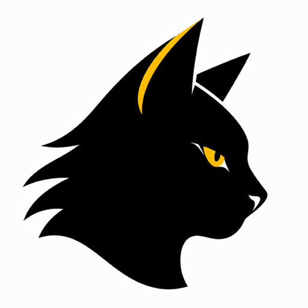
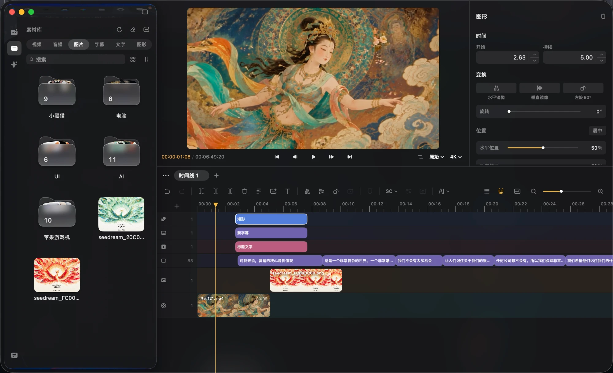
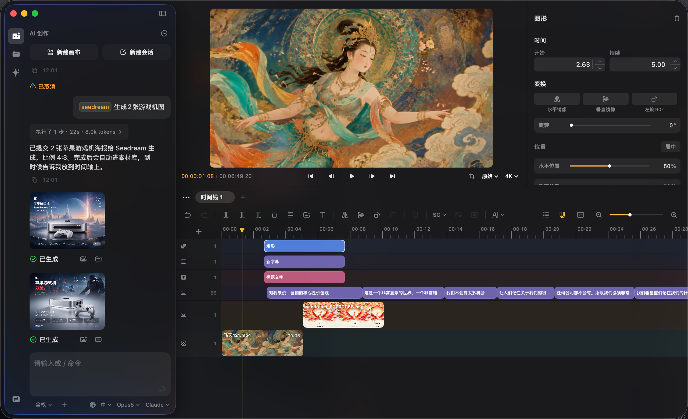
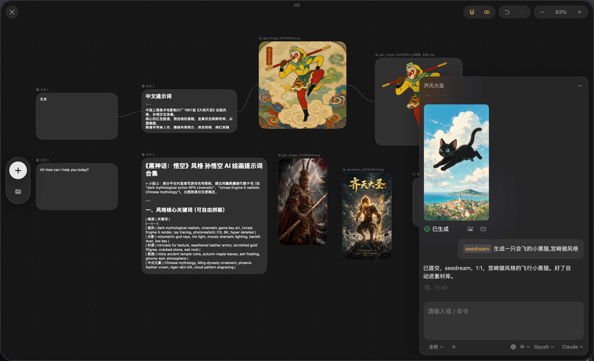

<p align="center">
  
</p>

<h1 align="center">黑猫剪辑 BlackCat</h1>

<p align="center">
  macOS 原生AI创作及视频剪辑工具<br>
  Swift · SwiftUI · AVFoundation · Core Image · Core ML · whisper.cpp
</p>

<p align="center">
  <a href="https://github.com/venico/BlackCat/releases/latest"></a>
  
  
  <a href="https://venico.github.io/blackcat-privacy/"></a>
</p>

---

<p align="center">
  
  <br><sub>多轨时间轴 —— 视频、图片、字幕、文字、图形各走各的轨道</sub>
</p>

<p align="center">
  
  <br><sub>AI 创作 —— 说一句话，素材自己生成好、进素材库，再叫它放上时间轴</sub>
</p>

<p align="center">
  
  <br><sub>AI 画布 —— 卡片连线，上游就是下游的参考素材</sub>
</p>

---

## 功能特性

### 多轨时间轴

- 视频 / 音频 / 图片 / 字幕 / 文字 / 图形，外加滤镜、调节、特效三类效果轨
- 剪切、分割、复制粘贴、撤销重做（50 步）
- 多选、框选、跨轨拖动、整体搬运
- 轨道拖拽排序、自动吸附、防重叠、触控板捏合缩放
- **多时间线标签页** — 一个项目里开多条时间线，关闭不等于删除
- **复合片段** — 多个片段打包成一个，可进入内部编辑，导出内容完整

### AI 创作

- **AI 生成** — 视频 / 图片 / 音频 / 文字，二十余个模型多供应商接入
- **AI 画布** — 节点连线式创作台，上游卡片是下游的参考素材，依赖自动排队调度
- **Agent** — 带工具调用的执行循环，能直接读写你的项目：加片段、改字幕、套特效、生成素材
  - 三种模式：计划（只读）/ 自动（危险操作先问）/ 全权
  - `/` 命令点名 Skill 或生成模型
  - **MCP** — stdio 与 HTTP 两种传输，工具按需挂载
  - **Skill 安装** — 给个 git 地址直接装
  - 长期记忆，分全局习惯与本项目设定
- **AI 剪辑** — 语音识别后交给大模型挑出精彩片段，一键成片

### 字幕与语音

- **Whisper 本地语音识别** — 基于 [whisper.cpp](https://github.com/ggerganov/whisper.cpp)，离线运行
- **Silero VAD 时间对齐** — 静音处不再挂字幕，起止贴着真实语音
- **字幕 AI 校对** — 修错别字、去机器翻译腔、合并被切碎的句子；时间戳不交给模型
- **字幕转语音** — Fish / OpenAI / ElevenLabs / MiniMax，语速与时长自动对齐
- 12 种语言翻译，5 种引擎（Google / DeepL / Apple / 有道 / 火山）
- SRT / ASS / VTT 导入，编码自动检测，繁体转简体

### 画面处理

- **滤镜轨** 14 种、**调节轨** 11 个参数、**特效轨** 26 种，各自只作用于它下面的轨道
- **自定义 LUT** — 导入 `.cube`，留在滤镜库「自定义」组里
- **11 种转场** — 溶解、淡黑、推入（4 向）、缩放、滑入（4 向）
- **清晰度提升** — 6 个超分引擎，本地 Core ML 或 fal.ai 云端
- **智能抠图** — BiRefNet（Core ML）或系统内置，模型按需下载
- **音轨分离** — demucs.cpp 分出 6 条乐器轨
- **场景检测** — PySceneDetect 自动切分
- 图形图层 8 种（含钢笔）、文字标题、图片描边、变速、镜像旋转

### 导出

- AVAssetWriter 引擎 + GPU 快速路径
- 按图层顺序合成，复合片段内容完整烧录
- H.264 硬件编码，长视频内存稳定
- 多窗口可并发导出，可取消、有实时进度

### 项目与素材

- **多窗口** — 一个项目一个窗口，菜单命令按窗口定向路由，关窗自动保存
- **全局素材库** — 跨项目共用，支持嵌套虚拟文件夹、拖动排序、多选
- `.bcj` 项目文件，Finder 双击直接打开，自动保存
- 欢迎页最近文件（缩略图 / 列表两视图 + 搜索）
- **应用内自动更新** — 检查、下载、自我替换重启

## 系统要求

| 项目 | 要求 |
|------|------|
| 操作系统 | macOS 14.0 (Sonoma) 及以上 |
| 芯片 | Apple Silicon 或 Intel |
| 内存 | 建议 8GB 以上 |

## 安装

### 下载

前往 [Releases](https://github.com/venico/BlackCat/releases/latest) 下载最新版本。

### 从源码构建

```bash
git clone https://github.com/venico/BlackCat.git
cd BlackCat
swift build
```

## 技术架构

```
Sources/VideoEditor/
├── App/                      # 应用入口、菜单栏、多窗口路由
├── Models/
│   ├── ProjectState          # 核心状态，按职责拆成多个扩展
│   │   ├── +IO / +Media      # 项目读写、素材库
│   │   ├── +Timeline / +Edit # 时间轴与编辑操作
│   │   ├── +Subtitle         # 字幕、Whisper、翻译
│   │   └── +Preview          # 预览合成、转场
│   ├── ColorCompositor       # 自定义 AVVideoCompositing（色调/裁剪/转场/叠加层）
│   ├── FilterEngine          # 滤镜与 LUT，预览和导出共用一份
│   ├── EffectEngine          # 特效
│   ├── AIVideoService        # 多供应商生成接口
│   ├── CanvasState           # AI 画布
│   ├── Agent/                # 执行循环、工具、MCP、Skill、长期记忆
│   ├── WhisperTranscriber    # 本地语音识别 + VAD 对齐
│   ├── Clarity* / BiRefNet   # 超分与抠图（Core ML）
│   └── AudioSeparator        # demucs.cpp 音轨分离
└── Views/
    ├── Timeline/ Player/     # 时间轴、预览播放器
    ├── Inspector/            # 属性面板
    ├── MediaLibrary/         # 素材库与 AI 聊天面板
    ├── Canvas/               # AI 画布
    └── Export/               # 导出
```

**技术栈**

- **界面**：SwiftUI + AppKit（自绘标题栏与菜单、系统材质外观）
- **音视频**：AVFoundation，自定义 `AVVideoCompositing` 渲染管线
- **图像**：Core Image，预览与导出共用同一份滤镜/特效代码
- **本地模型**：Core ML（超分、抠图）、whisper.cpp、demucs.cpp
- **外部依赖**：FFmpeg（静态编译打包进 app）

## 版本历史

| 版本 | 主要更新 |
|------|---------|
| v6.0 | AI 剪辑参数打通、生成任务可控（张数/换家重试）、纯图片项目效果修复 |
| v5.9 | MCP 真正接通、`install_skill`、长期记忆可增删改 |
| v5.6 ~ v5.8 | Agent 工具调用、`/` 命令、画布悬浮卡片、素材库虚拟文件夹 |
| v5.5 | 滤镜轨、调节轨、特效轨、多时间线标签页 |
| v5.1 ~ v5.2 | AI 画布、素材库全局化、画布成组与 markdown |
| v4.6 | 语音识别 VAD 对齐、字幕 AI 校对、多选整体移动 |
| v4.5 | 多窗口、关窗自动保存、并发导出 |
| v4.3 | 清晰度提升（6 引擎）、欢迎页重写、应用内自动更新 |
| v4.2 | 音轨分离、画面比例体系、BiRefNet 抠图、字幕转语音 |
| v4.0 ~ v4.1 | 预览区多选交互、视频拖拽实时同步、AI 参考内容多类型 |
| v3.8 ~ v3.9 | AI 视频生成、复合片段、场景检测、标记系统 |
| v3.0 ~ v3.7 | 转场、色调、变速、Whisper、图形图层、图层顺序重构 |
| v1.0 ~ v2.x | 多轨编辑器初版、`.bcj` 项目文件、FFmpeg 转码 |

## 隐私政策

黑猫剪辑不收集任何用户数据。语音识别、超分、抠图全部在本地运行；
只有你主动使用 AI 生成功能时，内容才会发往你自己配置的服务商。

[查看完整隐私政策](https://venico.github.io/blackcat-privacy/)

## 许可证

本项目为个人作品，保留所有权利。
